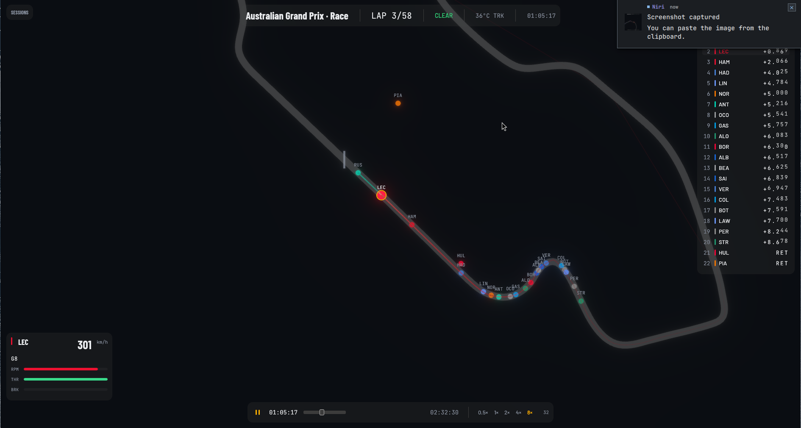

# F1 Replay

A real-time Formula 1 session replay visualizer built with **Bevy**. Browse and replay F1 sessions from 2018–2024 with live telemetry, animated classification, and cinematic camera controls.



## Features

### Session Discovery

* **Remote session browser** — Fetches the official F1 calendar from the Live Timing API
* **Year / Weekend / Session hierarchy** — Expand any season to see all Grand Prix weekends
* **On-demand loading** — Sessions load from the archive only when selected
* **Graceful fallback** — Displays an error and allows retry if the API is unreachable

### Live Telemetry

* **Click-to-select drivers** — Click any driver in the classification to pin their telemetry
* **Multi-driver comparison** — Track up to 3 drivers simultaneously
* **Real-time data** — Speed, RPM, throttle, brake, DRS status, and gear position
* **Animated traces** — Alpha-ramped, width-tapered polylines showing recent position history
* **Leader highlighting** — The race leader automatically receives a trail

### Visual Effects

* **Track reveal animation** — The circuit progressively draws itself while the camera pulls back from pole position during a 3.5-second cinematic intro
* **Bloom post-processing** — Selected cars glow with team-color halos
* **Digit-roll odometer** — Gap and lap counters animate with smooth vertical scrolling when values change
* **Smooth camera follow** — Click any car to follow it with exponential easing; click empty space or press `Esc` to release follow mode

### Camera Controls

| Input             | Action                               |
| ----------------- | ------------------------------------ |
| Scroll            | Zoom, anchored at cursor position    |
| Left-click + drag | Pan the view and release follow mode |
| Click car         | Follow the selected car              |
| `F`               | Reset and fit the entire track       |
| `Esc`             | Release camera follow                |

Camera controls automatically disable when the pointer is over UI panels.

### Classification

* **Live leaderboard** — Real-time position, driver code, and gap to leader
* **Gap display** — Time gaps such as `+1.234` or lap deltas such as `+1L`
* **Interactive selection** — Click any row to toggle telemetry for that driver
* **Team colors** — Accent bars and text colors match official team liveries

## Architecture

F1 Replay is a Rust workspace consisting of two crates:

### `f1-data`

A standalone library for fetching and parsing F1 Live Timing data.

Responsibilities include:

* **API client** — Fetches session data, position feeds, telemetry, and race-control messages
* **Streaming decoder** — Parses compressed JSON streams from the official API
* **Timeline engine** — Reconstructs continuous car trajectories from discrete position samples
* **Track derivation** — Extracts circuit centerlines from position data
* **Playback system** — Interpolates frames for smooth replay at arbitrary scrub positions

### `f1-replay`

A Bevy-based 2D visualization application.

Responsibilities include:

* **Session index** — Remote calendar discovery and lazy session loading
* **Rendering pipeline** — 2D ribbon track, car dots, selection rings, and trail overlays
* **UI system** — Glass-morphism panels for telemetry, leaderboard, transport controls, and session selection
* **Camera rig** — Pan, zoom, and follow with UI input suppression
* **Visual effects** — Bloom, digit-roll animations, and cinematic track reveal

## Building

### Prerequisites

* Rust 1.75+
* Git

Install Rust using [rustup](https://rustup.rs/).

### Clone and Build

```bash
git clone https://github.com/yourusername/f1-replay.git
cd f1-replay
cargo build --release
```

### Run

```bash
cargo run --release
```

On first launch, the application fetches the F1 calendar from the Live Timing API.

Select a season, expand a Grand Prix weekend, and choose a session to begin replay.

## Usage

1. **Browse sessions** — The application opens with the session picker. Select a year to load its calendar.
2. **Select a session** — Expand a weekend such as `Monaco Grand Prix` and select a session such as `Race`.
3. **Wait for loading** — A splash screen appears while the session data is downloaded and parsed.
4. **Watch the reveal** — The track draws itself while the camera pulls back from the grid.
5. **Explore the circuit** — Scroll to zoom, drag to pan, and click cars to follow them.
6. **Pin telemetry** — Select drivers in the classification panel to display their live telemetry.
7. **Scrub playback** — Use the transport controls to play, pause, and scrub through the session.

## Dependencies

* **[Bevy](https://bevyengine.org/)** — Game engine and ECS
* **[bevy_egui](https://github.com/vladbat00/bevy_egui)** — Immediate-mode UI
* **[reqwest](https://docs.rs/reqwest/)** — HTTP client for API requests
* **[tokio](https://tokio.rs/)** — Async runtime for non-blocking data loading
* **[serde](https://serde.rs/)** — Serialization and deserialization framework
* **[serde_json](https://docs.rs/serde_json/)** — JSON parsing

## Fonts

The application uses three fonts:

* **Barlow Condensed Bold** — Display text, titles, and large numbers
* **Barlow Medium** — Body text, driver codes, and labels
* **JetBrains Mono Regular** — Timestamps, telemetry values, and gaps

Fonts are bundled in:

```text
f1-replay/assets/fonts/
```

## Data Sources

* **[F1 Live Timing API](https://livetiming.formula1.com/)** — Official session data, position feeds, and telemetry streams
* **[Ergast API](https://ergast.com/mrd/)** — Historical race results and calendar fallback
* **[FastF1](https://github.com/theOehrly/Fast-F1)** — Inspiration and reference for F1 data analysis

## Roadmap

* [ ] Speed-colored car dots
* [ ] Brake-point visualization with red glow
* [ ] DRS zone visualization
* [ ] Pit-stop timeline with lap-time deltas
* [ ] Sector-time comparison
* [ ] Keyboard shortcuts (`Space` = play/pause, arrow keys = scrub)
* [ ] Pre-compiled binaries via GitHub Releases

## License

MIT

## Acknowledgments

* The F1 Live Timing API for providing session data
* The Bevy community for its documentation and examples
* FastF1 for pioneering F1 data analysis in Python
